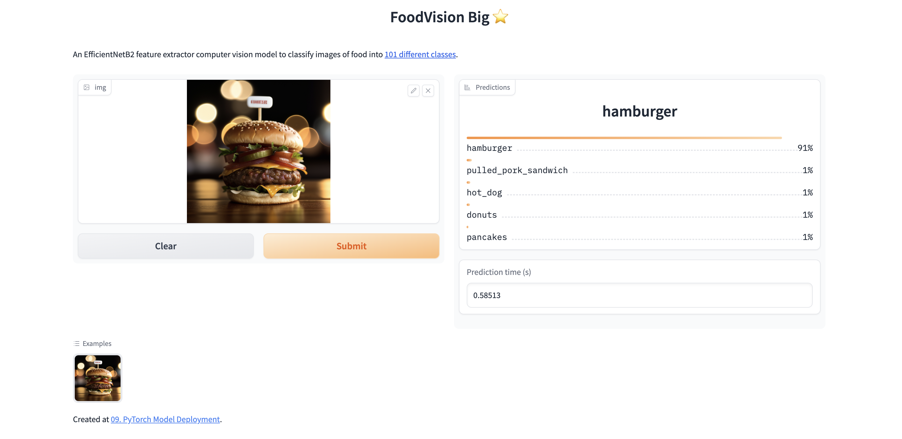

# Food 101 Classifier
[Zero to Mastery Learn PyTorch for Deep Learning](https://www.learnpytorch.io/) exercise  - Food 101 Classifier in PyTorch, algorithm implemented as follows:
- [TinyVGG](https://poloclub.github.io/cnn-explainer/)
- EffNetB2 Transfer Learning
- ViT-B/16 Transfer Learning

## Dataset: [Food101](https://data.vision.ee.ethz.ch/cvl/datasets_extra/food-101/)
* use 20% of Food101 data

## Train & Save Model
```bash
# --m: model type(default/tinyvgg: TinyVGG, vit: ViT-B/16, effnet:EffNetB2)
# --e: epoch (default:2)
python main.py --m "vit" --e 3
```
## Demo
Use [gradio](https://www.gradio.app/) to demo model(EffNetB2) result, please click [link](https://huggingface.co/spaces/zolakarary/foodvision_big) to give it a try!
